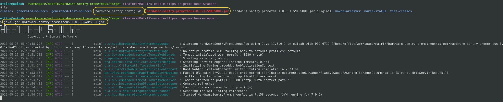
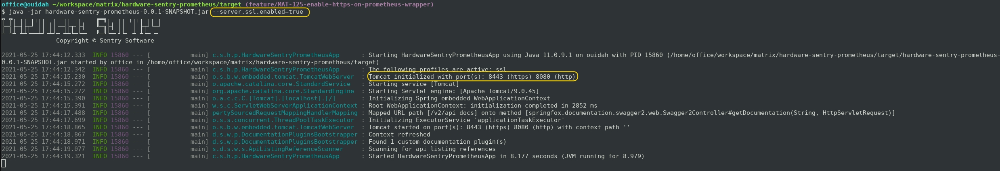

# How to use the Hardware Sentry Prometheus Exporter

  ## Basic execution

   ### Requirements

   - Have the **hardware-sentry-config.yml** file
     in the same directory as the **hardware-sentry-prometheus-_\<version\>_.jar** file.<br>
   
     ###### Example hardware-sentry-config.yml file content:
     ```yaml
     ---
     targets:
     
     - target:
         hostname: "ecs1-01"
         type: "LINUX"
       snmp:
         version: "V1"
         community: "public"
         port: 161
         timeout: 120
       selectedConnectors:
       - "MS_HW_DellOpenManage.hdfs"
       excludedConnectors: []
       unknownStatus: "WARN"
     
     - target:
         hostname: "ecs1-01"
         type: "LINUX"
       snmp:
         version: "V1"
         community: "public"
         port: 161
         timeout: 120
       selectedConnectors:
         - "MS_HW_DellOpenManage.hdfs"
       excludedConnectors: []
       unknownStatus: "WARN"
     
     - target:
         hostname: "ecs1-01"
         type: "LINUX"
       snmp:
         version: "V1"
         community: "public"
         port: 161
         timeout: 120
       selectedConnectors:
         - "MS_HW_DellOpenManage.hdfs"
       excludedConnectors: []
       unknownStatus: "WARN"
     ```

   ### Execution
   The simplest way to execute the Hardware Sentry Prometheus Exporter is :

   ```shell script
   $ java -jar hardware-sentry-prometheus-<version>.jar
   ```

   ###### Example:
   
   
   ###### Note:
   By default, the application can be accessed at http://localhost:8080/metrics.

  ## Using a custom YAML configuration file
  If you wish to specify another file instead of **hardware-sentry-config.yml**,
  you can use the _--target.config.file_ option
  with the relative or absolute path to the custom configuration YAML file:
  
  ```shell script
  $ java -jar hardware-sentry-prometheus-0.0.1-SNAPSHOT.jar --target.config.file=../custom-config.yml
  ```

  ## Using a different HTTP port
  If you wish to specify another port instead of _8080_,
  you can use the _--server.port_ option with the preferred port:
  
  ```shell script
  $ java -jar hardware-sentry-prometheus-0.0.1-SNAPSHOT.jar --server.port=8081
  ```

  ## Enabling HTTPS
  Enabling HTTPS can be done by using the _--server.ssl.enabled_ option:
  
  ```shell script
  $ java -jar hardware-sentry-prometheus-0.0.1-SNAPSHOT.jar --server.ssl.enabled=true
  ```
   ###### Example:
   
   
   ###### Note:
   Now, the application can be accessed at http://localhost:8080/metrics, or https://localhost:8443/metrics.

  ## Using a different HTTP port when HTTPS is enabled
  When HTTPS is enabled, if you wish to specify another HTTP port instead of _8080_,
  you can use the _--http.port_ option with the preferred port:
  
  ```shell script
  $ java -jar hardware-sentry-prometheus-0.0.1-SNAPSHOT.jar --server.ssl.enabled=true --http.port=8081
  ```
  ## Using a different HTTPS port when HTTPS is enabled
  When HTTPS is enabled, if you wish to specify another HTTPS port instead of _8443_,
  you can use the _--server.port_ option with the preferred port:
  
  ```shell script
  $ java -jar hardware-sentry-prometheus-0.0.1-SNAPSHOT.jar --server.ssl.enabled=true --server.port=8444
  ```
   ###### Note:
   The _--http.port_ and _--server.port_ options can be used simultaneously when HTTPS is enabled.

  ## Redirecting the HTTP port to the HTTPS port
  Redirecting the HTTP port to the HTTPS port can be done by using the _--server.ssl.redirect-http_ option:
  
  ```shell script
  $ java -jar hardware-sentry-prometheus-0.0.1-SNAPSHOT.jar --server.ssl.enabled=true --server.ssl.redirect-http=true
  ```
  ## Build Docker Image
  ### Prerequisites
  - *Git* to checkout the code.
  - *Java 11* to compile the code.
  - *Maven* to build the project.
  - *Docker Engine* to build and run the container.
  
  Building the exporter as a docker image can be done via the following steps:

  - From the **hardware-sentry-prometheus** directory, run:
    ```shell script
    $ mvn clean package
    ```
    If you haven't built the **matrix-engine** dependency, run *mvn clean package* from the root directory **matrix**

  - Run the following docker command from the **hardware-sentry-prometheus** directory:
    ```shell script
    $ docker build -t hardware-sentry-prometheus .
    ```

  ## Running Hardware Sentry Prometheus with Docker
  After building the docker image, bind-mount your *hardware-sentry-config.yml* configuration from the host by running:

  ```shell script
  $ docker run -d -p 8080:8080 -v /path/to/hardware-sentry-config.yml:/hardware-sentry/hardware-sentry-config.yml hardware-sentry-prometheus:latest
  ```